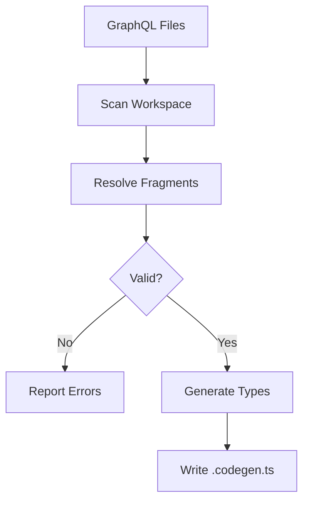

# Architecture Overview

This document describes the internal architecture of graphql-rust, explaining how its components work together to provide LSP, validation, and type generation.

## System Architecture

```
┌─────────────────────────────────────────────────────────────────┐
│                        User's Editor                            │
│  (VSCode / Neovim / IntelliJ / Other LSP Client)               │
└────────────────────────────┬────────────────────────────────────┘
                             │
                             ▼
┌─────────────────────────────────────────────────────────────────┐
│                    graphql-rust LSP Server                       │
│  ┌───────────────────────────────────────────────────────────┐  │
│  │                       Backend                              │  │
│  │  • DocumentState map (DashMap)                           │  │
│  │  • Schema cache (two-tier: memory + disk)                 │  │
│  │  • Fragment indices                                       │  │
│  │  • File watchers                                          │  │
│  └───────────────────────────────────────────────────────────┘  │
│            │                    │                    │          │
│            ▼                    ▼                    ▼          │
│  ┌────────────────┐   ┌────────────────┐   ┌────────────────┐  │
│  │ graphql-core   │   │graphql-features│   │  Diagnostics   │  │
│  │                │   │                │   │    Engine      │  │
│  │ • Tree-sitter  │   │ • Hover        │   │                │  │
│  │   parsing      │   │ • Completion   │   │ • Validation    │  │
│  │ • Schema cache │   │ • Go-to-def    │   │ • Diagnostics   │  │
│  │ • Config       │   │ • References   │   │ • Code actions  │  │
│  └────────────────┘   └────────────────┘   └────────────────┘  │
└────────────────────────────┬────────────────────────────────────┘
                             │
                             ▼
┌─────────────────────────────────────────────────────────────────┐
│                    Codegen Pipeline                              │
│  ┌───────────────────────────────────────────────────────────┐  │
│  │  1. Scan workspace for .graphql and embedded blocks       │  │
│  │  2. Resolve fragments and operations                       │  │
│  │  3. Validate against schema                                │  │
│  │  4. Generate TypeScript types                              │  │
│  │  5. Output: .codegen.ts files                              │  │
│  └───────────────────────────────────────────────────────────┘  │
└─────────────────────────────────────────────────────────────────┘
```

## Core Components

### graphql-core

The foundation of the entire system, providing:

- **DocumentState**: Manages the lifecycle of a single file (GraphQL or TS/TSX)
  - Tree-sitter parsing for incremental updates
  - Rope-based text storage for efficient edits
  - Embedded GraphQL block extraction and tracking

- **Engine**: Orchestrates workspace-wide operations
  - Parallel fragment/operation discovery using `rayon`
  - Fragment dependency resolution
  - Workspace validation orchestration

- **Schema & SchemaCache**: Two-tier caching for performance
  - **L1 (Memory)**: Process-lifetime cache, invalidated by file mtime
  - **L2 (Disk)**: Persistent cache in OS-specific cache directory
  - Schema merging from multiple files

- **Config**: Parses and validates `graphql.yaml`

### graphql-features

LSP capabilities implemented as extension traits on `DocumentState`:

| Feature | Description |
|---------|-------------|
| **Hover** | Rich documentation for fields, arguments, types |
| **Completion** | Context-aware suggestions for fields, arguments, types |
| **Go-to-Definition** | Navigate to fragment/type definitions |
| **Find References** | Find all uses of a fragment or type |
| **Diagnostics** | Real-time validation using Tree-sitter + apollo-compiler |
| **Semantic Tokens** | Enhanced syntax highlighting |

### graphql-lsp

The LSP server implementation using `tower-lsp`:

- **Backend**: Main state holder managing documents, schemas, and indices
- **FileWatchers**: Monitors workspace for changes
- **Diagnostics**: Push-based real-time feedback
- **Request handling**: Cancellable operations via `AtomicBool`

### graphql-codegen

TypeScript type generation:

- **Type Generation**: Type-safe interfaces for queries, mutations, subscriptions
- **Fragment Support**: Automatic type composition for shared fragments
- **Performance**: Parallel generation across large workspaces
- **Validation**: Pre-generation validation against schema

## Data Flow

### LSP Initialization

1. Client sends `initialize` request
2. Server loads configuration (`graphql.yaml`)
3. Server initializes schema cache
4. Server scans workspace for GraphQL files
5. Server returns capabilities to client

### Document Change

1. Client sends `didChange` notification
2. Server applies change to `DocumentState`
3. Server re-parses with Tree-sitter (incremental)
4. Server runs diagnostics
5. Server pushes diagnostic results to client

### Codegen Flow



## Performance Characteristics

### Caching Strategy

- **Schema Cache**: 95-99% faster for repeated loads (L1), 10-80% faster (L2)
- **Tree-sitter**: Incremental parsing avoids re-parsing entire files
- **Fragment Indices**: O(1) lookups for fragment definitions/dependents
- **Parallel Scanning**: Uses `rayon` for data parallelism

### Memory Management

- `Arc<Valid<Schema>>` for shared immutable schema data
- `DashMap` for thread-safe document access
- `Rope` for efficient text storage with incremental edits

## File Watching

The LSP automatically watches:
- GraphQL schema files
- Configuration files (`graphql.yaml`)
- Source files containing GraphQL operations

Changes trigger:
- Schema reload (if schema changed)
- Re-validation (if source changed)
- Codegen (if enabled and file is a GraphQL operation)

## Cancellation

Long-running operations are cancellable:
- Workspace scans use `AtomicBool` for cancellation
- LSP requests can be cancelled by the client
- File watchers respect cancellation tokens
